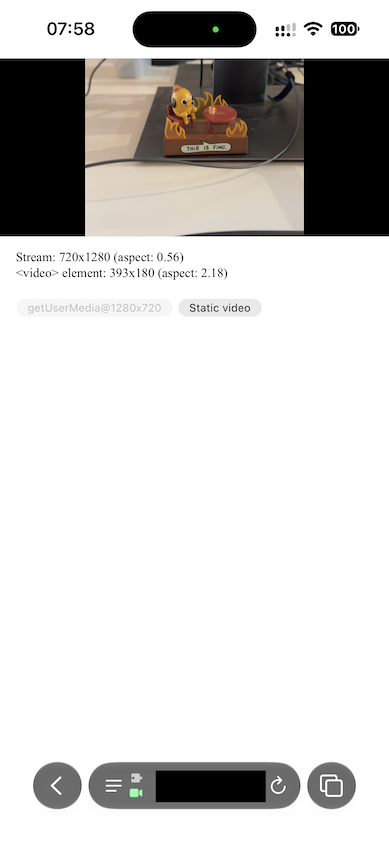
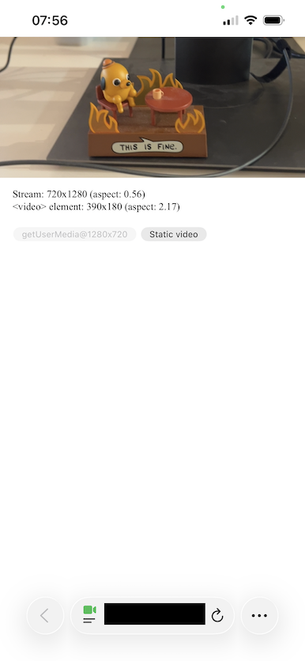

# iOS 27 Safari video letterboxing

Starting with iOS 27, it seems that video from getUserMedia in portrait orientation gets letterboxed if it's displayed in a video element with a wide aspect ratio, even if `object-fit` is `cover`.

Additionally, it only seems to affect video from getUserMedia(). A static video file of the same resolution (HD, rotated) displays without letter-boxing.

## Screenshots

### iOS 27

This is from an iPhone 15 Pro.

### iOS 26

This is from an iPhone 13 Pro.

